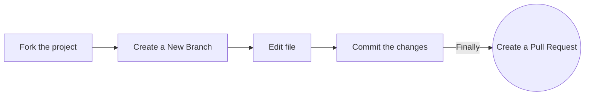

<h1 align="center">Open-source-practice Pull Requests </h1>

<div align="center">
<!-- ALL-CONTRIBUTORS-BADGE:START - Do not remove or modify this section --> 
 
[](#contributors-)
<a href="https://github.com/recodehive/Opensource-practice/stargazers"></a>
<a href="https://github.com/recodehive/Opensource-practice/network/members"></a> 
<a href="https://github.com/recodehive/Opensource-practice/pulls"></a>
<a href="https://github.com/recodehive/Opensource-practice/issues"></a>
<a href="https://github.com/recodehive/Opensource-practice/graphs/contributors"></a>
<a href="https://github.com/recodehive/Opensource-practice/blob/master/LICENSE"></a>
[](https://visitcount.itsvg.in)
<!-- ALL-CONTRIBUTORS-BADGE:END -->
This is the all in one place for documentation help regarding the postman challenge.
</div>

Repository for you to raise a Pull Request to **practice** open-source ! 🎉

Learn GithHub from Scratch here: https://recodehive.com/github-tutorials/

### Add your name to the alphabetical list and, optionally, a link to your GitHub account (in alphabetical order below your letter too)

### Option 1. Complete this process in GitHub (in your browser)


dd
**1. Fork the project:**

- Click the gray <kbd>Fork</kbd> button at the top right of the previous page. This creates your copy of the project and saves it as a new repository in your GitHub account.


**2. Create a New Branch:**

- On your new repository's page, click the gray main button in the upper left to reveal a dropdown menu.
- Enter the name of your new branch in the text box. (Branch names usually refer to what is being changed. Example: nameAdd).
  -Click on Create branch <new branch name>, which will automatically take you to your new branch. You can make edits on the main branch, but this may cause issues down the line. The best practice is to create a new branch for each separate issue you work on. That way your main branch remains in sync with Gssoc's main branch.

**3. Edit:**

- On the top right of the Readme file, click on the pencil icon to edit the file by **adding your name and your GitHub profile link to the section that matches your Initial in [this list](https://github.com/GSSoC24/being-an-GSSoc24/blob/main/docs/readme.md#GSSoC24-Community). Make sure that your name is in alphabetical order.**
- After editing the Readme file, add a commit message and click on the green button saying "Commit Changes". Make sure you have selected the branch you have created.

**4. Raise a Pull Request:**

- Click `Pull Requests` option in your forked repository (which is the third option at the top of this page after the options `Code` and `Issues`).
- Click the green New Pull Request button. This will prep the new pull request for you by auto-filling the base repository: base with 'GssocCommunity: main' AND auto-filling your head repository: compare with your repository: main
- Click on your head repository's `compare` dropdown, and switch branches from your 'main' branch to `<new branch name>`.
- Finally, click the green `Create Pull Request` button. Great job! You did it!

You can ask questions by raising an [issue](https://github.com/GSSoC24/being-an-GSSoc24/issues).

### Option 2. Complete this process on your computer (locally)

**1. Fork the project:**

- Click the gray <kbd>Fork</kbd> button at the top right of the previous page. This creates your copy of the project and saves it as a new repository in your GitHub account.


**2. Clone this project on your computer:**

- Go to your profile. You will find forked repo named **_open-source-practice_**. go to the repo by clicking on it.
- Click on the green Code button, then either the HTTPS or SSH option, and, click the icon to copy the URL. Now you have a copy of the project. Thus, you can play around with it locally on your computer.

- Run the following commands into a terminal window (Command Prompt, Powershell, Terminal, Bash, ZSH). Do this to download the forked copy of this repository to your computer. 


```bash
  git clone https://github.com/GSSoC24/being-an-GSSoc24.git
```

- Switch to the cloned folder. You can paste this command into the same terminal window. 


```bash
  cd being-an-GSSoc24
```

**3. Open in code Editor:**

- Open the `README.md` file


  
**4. Create a new branch:**


- Your username would make a good branch because it's unique.  


```bash
  git checkout -b <name-of-new-branch>
```

**5. Edit the File:**


- **Add your name to the section that matches your Initial in [this list](https://github.com/EddieHubCommunity/open-source-practice#hacktoberfest-community), make sure that your name is in alphabetical order. Then save your changes.**

- For example
  `- [Full Name](https://github.com/your-username)`

**5. Stage your changes:**

```bash
  git add README.md 
```

or

```bash
  git add .
```

**6. Commit the changes:**


```bash
  git commit -m "Add <your-github-username>"
```

- Check the status of your repository.

```bash
  git status
```

- The response should be like this:


```bash
On branch <name-of-your-branch>
nothing to commit, working tree clean
```

**7. Pushing your repository to GitHub:**

```bash
  git push origin <name-of-your-branch>
```

or

```bash
  git branch -M main
  git push -u origin main
```


> **Warning**: If you get an error message like the one below, you probably forgot to fork the repository before cloning it. It is best to start over and fork the project repository first.

```bash
ERROR: Permission to https://github.com/GSSoC24/being-an-GSSoc24 denied to <your-github-username>.
fatal: Could not read from remote repository.
Please make sure you have the correct access rights and that the repository exists.
```

**8. Raise a Pull Request:**
https://github.com/GSSoC24/being-an-GSSoc24

- On the GitHub website, navigate to your forked repo - on the top of the files section, you'll notice a new section containing a `Compare & Pull Request` button! ![createpr]

- Click on that button, this will load a new page, comparing the local branch in your forked repository against the main branch in the GSSoC'24 Being an Gssoc repository. Do not make any changes in the selected values of the branches (do so only if needed), and click the green `Create Pull Request` button. 
  Note: A pull request allows us to merge your changes with the original project repo.

- Your pull request will be reviewed and then eventually merged.

Hurray! You successfully made your first contribution! 🎉

---

## How can I fix a merge conflict?

A GitHub conflict is when people make changes to the same area or line in a file. This must be fixed before it is merged to prevent collision in the main branch.

- **To read more about this, go to [GitHub Docs - About Merge Conflicts](https://docs.github.com/en/github/collaborating-with-pull-requests/addressing-merge-conflicts/about-merge-conflicts)**

- **To find out about how to fix a Git Conflict, go to [GitHub Docs - Resolve Merge Conflict](https://docs.github.com/en/github/collaborating-with-pull-requests/addressing-merge-conflicts/resolving-a-merge-conflict-on-github)**


## `GSSoC24-Community`

### **Contents**

| [A](#a) | [B](#b) | [C](#c) | [D](#d) | [E](#e) | [F](#f) | [G](#g) | [H](#h) | [I](#i) | [J](#j) | [K](#k) | [L](#l) | [M](#m) | [N](#n) | [O](#o)
| [P](#p) | [Q](#q) | [R](#r) | [S](#s) | [T](#t) | [U](#u) | [V](#v) | [W](#w) | [X](#x) | [Y](#y) | [Z](#z) | [0-9](#0-9) | 

- ### **A**
- [Amulyakamtam]
  - [Aman Singh](https://github.com/amanshh)
  - [Aabhirup Paul](https://github.com/paul-abhirup)
  - [Alok Vishwakarma](https://github.com/Alokvish04)
  - [Aniket Singh](https://github.com/ALIVE435)
  - [Afifa Sadiq](https://github.com/AfifaSadiq)
  - [Anshika Saini](https://github.com/Anshikaa-Saini)
  - [Anushree mehta](https://github.com/anushreemehta6)
  - [Amulya Jain](https://github.com/AmulyaJain2004)
  - [Adifa Saniya](https://github.com/adifa_7)
  - [Akshitha](https://github.com/AKSHITHA-CHILUKA)
  - [Akshaya ](https://github.com/Akshaya1256)
  - [Akshaya Chinnamgari](https://github.com/AkshayaChinnamgari)
  - [Amrutha Bysani](https://github.com/AMRUTHA-BYSANI)


| [`Back To Top`](#contents) |

- ### **B**
  - 
| [`Back To Top`](#contents) |

- ### **C**
 - [Chakrika sai D](https://github.com/CHAKRIKA-SAI-D)
| [`Back To Top`](#contents) |

- ### **D**
  - [Dipesh Mittal](https://github.com/zeeno2616)
  
| [`Back To Top`](#contents) |

- ### **E**
- [Exynos](https://github.com/GSS0C24)
  - 
| [`Back To Top`](#contents) |

- ### **F**
  - 
| [`Back To Top`](#contents) |

- ### **G**

  - [GSOC Website](https://github.com/GSSOC'24)

  - [Gssoc](https://github.com/GSS0C24)

| [`Back To Top`](#contents) |

- ### **H**
  - [Harshitha](https://github.com/Harshitha22594)
  -  [Harsh](https://github.com/Harsh-o4)
  
| [`Back To Top`](#contents) |


- ### **I**
  - [Inam Yadav](https://github.com/INam1995)
 - [Isha Katiyar](https://github.com/ishakatiyar06)
  
| [`Back To Top`](#contents) |

- ### **j**
  - [Hima Varsha Karanam](https://github.com/22wh1a05a8)

- ### **J**
  - [VBhanusr](https://github.com/VBhanusr)
  - [Jisha](https://github.com/Jisha-tr)
  -[Jared](https://github.com/jjf2009)

  - 

| [`Rishita`](#https://github.com/) |

| [`Hello`](#contents) |


- ### **K**
  - [Kusum Desai](https://github.com/kusumdesai)
  - [Keerthi](https://github.com/kusumdesai)
  - [keerthi pippalla](https://github.com/keerthipippalla)

| [`Back To Top`](#contents) |

- ### **L**
  - 
| [`Back To Top`](#contents) |

- ### **M**

  - [Manvitha Chowtapalii](https://github.com/Manvithach97)
  - [Monika Agarwal ](https://github.com/monika1281)
  - [Monojit Pal](https://github.com/Monojit-Pal)

| [`Back To Top`](#contents) |


- ### **N**
  - [Nihar koche ](https://github.com/Niharkoche)
  - Nikitha Pagadala
  - [nagasharmada](https://github.com/nagasharmada)
  
| [`Back To Top`](#contents) |

- ### **O**
  - 
| [`Back To Top`](#contents) |

 - ### **P**
 - [Priya Raj](https://github.com/satyam969)
     - [Piyush Bagde](https://github.com/PiyushBagde)
    - [Prince Gupta](https://github.com/Princegupta101)
    - [Pratham Vishwakarma](https://github.com/Pratham-Vishwakarma)
    - [Practclg](https://github.com/Practclg)
    - [PraveenTVNS](https://github.com/PraveenThota3166)
    - [P Sreyanshu Anupam](https://github.com/psa21git)
    - [Prayag Thakur](https://github.com/PrAyAg9)
    - [Pushpa Vishwakarma](https://github.com/Pushpa472)

| [`Back To Top`](#contents) |

- ### **Q**
  - 
| [`Back To Top`](#contents) |

- ### **R**
  - [Reshma Madala](https://github.com/Reshma-Madala)
  - [Ritesh Sharma](https://github.com/RiteshS1)

| [`Back To Top`](#contents) |

 - ### **S**
    - [Safiullah Korai](https://github.com/Safiullahkorai-786)
    - [Samar Aanand](https://github.com/SamarAanand)
    - [Samarasimha Reddy Peyala](https://github.com/samarasimhapeyala)
    - [Sanjay KV](https://github.com/sanjay-kv)
    - [Sadhvika](https://github.com/Sadhvika55)
    - [Siddheya](https://github.com/Asymtode712)
    - [Sharmila](https://github.com/sharmi4590)
    - [Shirshendu R Tripathi](https://github.com/ShirshenduR)
    -[Sandeep Gupta](https://github.com/Sandigupta)(let's do it ✌️)
    - [Saraswati Chandra](https://github.com/saras-69)
   
         
| [`Back To Top`](#contents) |

- ### **T**
  -   [Thanvi Shreya](https://github.com/thanvishreya123)`
  -   [Test](https://github.com/test)

| [`Back To Top`](#contents) |

- ### **U**
  - 
| [`Back To Top`](#contents) |

- ### **V**
  - [VARSHINI](https://github.com/Varshini0703)
  - 
| [`Back To Top`](#contents) |

- ### **W**
  - 
| [`Back To Top`](#contents) |

- ### **X**
  - 
| [`Back To Top`](#contents) |

- ### **Y**
  - [Yash K. Saini](https://github.com/yashksaini-coder)
  
| [`Back To Top`](#contents) |
  - [Yashvi Goyal](https://github.com/yg2505)
  
| [`Back To Top`](#contents) |


- ### **Z**
  - 
| [`Back To Top`](#contents) |

## Our Pledge

We take participation in our community as a harassment-free experience for everyone and we pledge to act in ways to contribute to an open, welcoming, diverse and inclusive community. 
 
