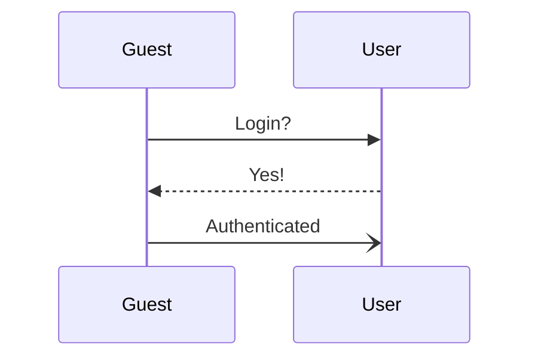
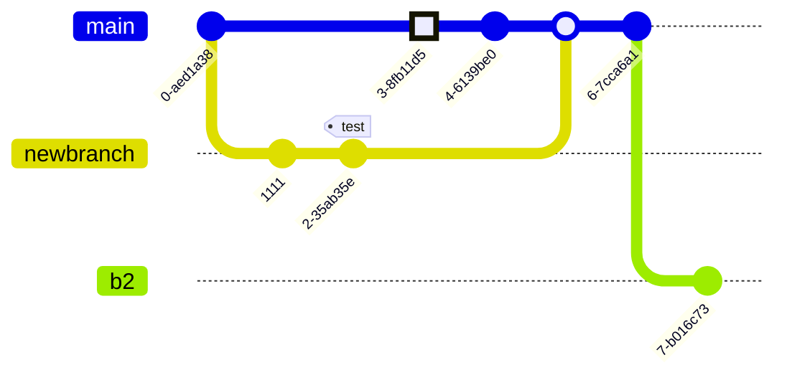
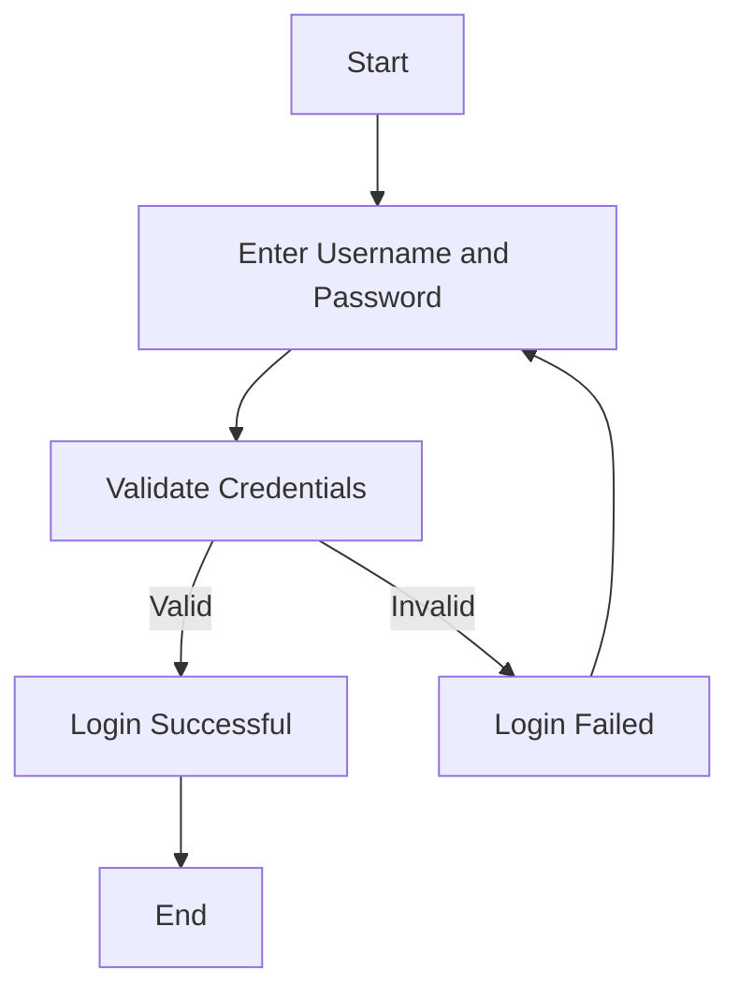

## Authentication

> Product owner
> Users wish to use their existing authentication

Login with GitHub OAuth with NextAuth library.



### Prerequisites 

These are the subtasks required:
- [x] install library
- [ ] look into https://github.com/eddiejaoude/eddiejaoude/issues/99
- [ ] setup OAuth app
...

We must also include the login hook:

```js
// create the new user a Stripe account
const user = getUser();
const stripe = createNewStripeUser(user);
```

### After

Use feature flags to hide login button until fully tested

> [!CAUTION]
> Do not run in production until after migration





